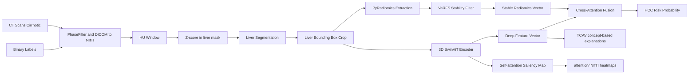

# Architecture

A guide to the code, the data flow, and the tools available for debugging and
interpretability. Pair this with [README.md](README.md) for the high-level
project overview.

## Pipeline stages (A -> M)



## File responsibility table

| Stage | What                                 | File                                                           |
| ----- | ------------------------------------ | -------------------------------------------------------------- |
| A, B  | DICOM -> NIfTI + phase filtering     | [src/data/dicom_loader.py](src/data/dicom_loader.py)           |
| C, D  | HU window + Z-score in liver mask    | [src/data/preprocessing.py](src/data/preprocessing.py)         |
| E     | Liver segmentation (TotalSegmentator)| [src/data/liver_segmentation.py](src/data/liver_segmentation.py) |
| F     | Liver bbox crop + crop_metadata.json | [src/data/cropping.py](src/data/cropping.py)                   |
| G     | PyRadiomics extraction               | [src/features/radiomics_extractor.py](src/features/radiomics_extractor.py) |
| H     | VaRFS stability + correlation prune  | [src/features/varfs_selection.py](src/features/varfs_selection.py) |
| I     | Classical baseline (RandomForest)    | [src/features/baseline_classifier.py](src/features/baseline_classifier.py) |
| J, K  | 3D SwinViT encoder + saliency map    | [src/models/swin_vit.py](src/models/swin_vit.py)               |
| J     | Swin backbone pretrained loader       | [src/models/pretrained_swin.py](src/models/pretrained_swin.py) |
| -     | Patient-level SwinViT k-fold CV        | [src/models/cv_training.py](src/models/cv_training.py)          |
| L     | Cross-attention fusion               | [src/models/fusion.py](src/models/fusion.py)                   |
| M     | Classification head + Focal Loss     | [src/models/classifier.py](src/models/classifier.py)           |
| -     | Training loop + early stopping       | [src/models/trainer.py](src/models/trainer.py)                 |
| -     | Plots + heatmap I/O + TCAV plots     | [src/utils/visualization.py](src/utils/visualization.py)       |
| -     | Concept-based interpretability (TCAV)| [src/utils/tcav/](src/utils/tcav/) (`concepts.py`, `core.py`, `io.py`, `types.py`) |
| -     | Logging (text + JSONL + helpers)     | [src/utils/logger.py](src/utils/logger.py)                     |
| -     | Per-run metadata + failure capture   | [src/utils/run_metadata.py](src/utils/run_metadata.py)         |
| -     | Config / seed / directories          | [src/utils/config.py](src/utils/config.py)                     |

## Configuration files

The project uses two YAML config files with different criticality levels:

| File | Required | Purpose |
| ---- | -------- | ------- |
| [`configs/default.yaml`](configs/default.yaml) | **Yes** — pipeline fails without it | All scientific, clinical and training hyperparameters. Validated at load time: missing `paths`, `seed`, `preprocessing` or `swin_vit` sections raise `KeyError` immediately. |
| [`configs/visualization.yaml`](configs/visualization.yaml) | No — optional | Presentation parameters (DPI, figure sizes). When absent every plot function uses built-in defaults. |

### `configs/default.yaml` — sections reference

| Section | Key parameters | Consumed by |
| ------- | -------------- | ----------- |
| `paths` | All input/output directory and file paths | Every script via `ensure_dirs` |
| `preprocessing` | `phase_keywords`, `hu_window`, `zscore_normalization`, `normalization_scope`, `voxel_spacing` | `run_preprocessing.py` |
| `swin_vit` | `img_size`, `window_size` (must divide `img_size`), `embed_dim`, `depths` | `src/models/swin_vit.py` |
| `cross_attention` | `num_heads`, `hidden_dim` | `src/models/fusion.py` |
| `radiomics` | `feature_classes`, `bin_width` | `run_radiomics.py` |
| `varfs` | `n_bootstrap`, `stability_threshold`, `correlation_threshold` | `src/features/varfs_selection.py` |
| `training` | `batch_size`, `learning_rate`, `epochs`, `deterministic`, `cudnn_benchmark` | `run_training.py`, `set_seed()` |
| `tcav` | `cav_C`, `significance_threshold`, `permutation_sets`, `extract_batch_size` | `run_tcav.py`, `src/utils/tcav/` |
| `visualization` | `window_center`, `window_width` | `src/utils/visualization.py` |
| `seed` | Single integer | `set_seed(cfg)` — called once per script |

### `configs/visualization.yaml` — sections reference

| Section | Key parameters | Consumed by |
| ------- | -------------- | ----------- |
| `dpi` | Output resolution for all saved PNGs | All `plot_*` functions |
| `figsize.*` | Per-chart width/height in inches (`roc`, `ablation`, `training_curves`, `slice_overlay`, `tcav_bar_*`, `concept_heatmap_*`) | Individual `plot_*` functions via `viz_cfg` kwarg |

Load the visualization config in scripts that produce plots:
```python
from src.utils.config import load_config, load_viz_config
cfg = load_config(args.config)
viz_cfg = load_viz_config()   # returns {} if file absent
```
Then pass `viz_cfg=viz_cfg` to any `plot_*` call.

### Phase 4 (SwinViT) — random init vs pretrained

[`scripts/run_training.py`](scripts/run_training.py) with `--phase swinvit` runs
[src/models/cv_training.py](src/models/cv_training.py): each fold builds
[`SwinViT3D`](src/models/swin_vit.py), then optionally loads tensors into `encoder` via
[src/models/pretrained_swin.py](src/models/pretrained_swin.py) when
`swin_vit.pretrained_weights` is set in [configs/default.yaml](configs/default.yaml).
If the path is `null`, empty, or the file is missing on disk, training continues from random
encoder weights (missing-file path emits a WARNING). The classification `head` is always
task-specific; Phase 5 fusion still uses deep features produced by this encoder after fine-tuning.

## Data flow on disk

```
data/raw/<PID>/before/                     <- DICOM (downloaded, never written)
        |
        v   scripts/run_preprocessing.py
data/processed/<PID>/before.nii.gz          <- normalized HU + Z-score
data/processed/<PID>/before_liver.nii.gz    <- TotalSegmentator binary mask
data/processed/<PID>/before_cropped.nii.gz  <- cropped to liver bbox
data/processed/<PID>/crop_metadata.json     <- bbox + zscore + original shape
        |
        +--> scripts/run_radiomics.py
        |        data/raw_radiomics_features.csv
        |        data/varfs_filtered_features.csv
        |        data/varfs_selected_features.json
        |        models/saved/radiomics_baseline.pkl
        |        results/baseline_metrics.json
        |        results/baseline_scores.csv             <- OOF (1 row per patient)
        |
        +--> scripts/run_training.py --phase swinvit    (5-fold patient-level CV)
        |        models/saved/swinvit_fold{1..5}.pth
        |        models/saved/best_swinvit_model.pth     <- highest-AUC fold
        |        models/saved/swinvit_deep_extractor.pth
        |        data/swinvit_oof_scores.csv             <- OOF probabilities
        |        data/deep_features.csv                  <- OOF deep vectors
        |        results/training_history_swinvit_fold{1..5}.json
        |
        +--> scripts/run_training.py --phase fusion     (5-fold patient-level CV)
        |        models/saved/fused_cross_attention_fold{1..5}.pth
        |        models/saved/fused_cross_attention.pth  <- best fold
        |        data/fusion_oof_scores.csv              <- OOF probabilities
        |        results/training_history_fusion_fold{1..5}.json
        |
        +--> scripts/run_evaluation.py                  (joins OOF CSVs by patient_id)
        |        results/evaluation_metrics.json         <- AUC / sens / spec / PR-AUC
        |        attention/<PID>_attention.nii.gz        <- qualitative heatmaps
        |        Plots/roc_comparison.png
        |        Plots/ablation_bar_chart.png
        |        Plots/training_curves.png               <- fold-1 history (when present)
        |
        +--> scripts/run_tcav.py
        |        tcav/cavs.npz
        |        tcav/train_accuracies.json
        |        results/tcav_per_feature_scores.json
        |        results/tcav_per_family_scores.json
        |        Plots/tcav_per_feature_bar.png
        |        Plots/tcav_per_family_bar.png
        |
        +--> scripts/run_inference.py
                results/inference_<PID>.json
                attention/<PID>_attention.nii.gz   (if --save_heatmap)
```

## Logging and debugging

Every script accepts `--log-level {DEBUG,INFO,WARNING,ERROR}` and respects the
`HCC_LOG_LEVEL` env var. The logger writes three streams:

1. **Console** -- coloured (when `stdout` is a tty).
2. `logs/<phase>.log` -- standard text log (`DEBUG` and above).
3. `logs/<phase>.log.jsonl` -- one JSON event per line, perfect for `jq`.

Helpers exported from [src/utils/logger.py](src/utils/logger.py):

| Helper                     | When to use it                                                  |
| -------------------------- | --------------------------------------------------------------- |
| `setup_logger(name, ...)`  | Once at the start of each script's `main()`.                    |
| `get_logger(name)`         | In every module to get a child logger.                          |
| `log_section(logger, ...)` | Visual banner between phases or per-patient blocks.             |
| `log_dict(logger, ...)`    | Pretty-print a config or metrics dict at DEBUG level.           |
| `log_exception(logger, e)` | Traceback + structured context for triage.                      |
| `tqdm_logger(...)`         | Iterator wrapper that emits a DEBUG line every N items.         |

Per-run metadata is written automatically by every script via
[src/utils/run_metadata.py](src/utils/run_metadata.py):

* `logs/run_<phase>_<timestamp>.json` -- config snapshot, git SHA, Python /
  Torch versions, CUDA availability, hostname, CLI args.
* `logs/<phase>_failures.jsonl` -- one JSON event per failed patient with the
  full traceback (handy for `--patient $(jq -r .patient_id < failures.jsonl)`
  re-runs).

## Where do I look when X breaks?

| Symptom                                         | First place to look                                               |
| ----------------------------------------------- | ------------------------------------------------------------------ |
| Wrong CT phase ingested                         | `logs/preprocessing.log` -- search for `ACCEPTED` / `REJECTED`.   |
| Empty liver mask / missing cropping             | `logs/preprocessing_failures.jsonl` -- check `error_msg` per PID. |
| AUC is `nan`                                    | Single-class fold -> inspect `data/labels.csv` distribution.      |
| TCAV crashes with `LookupError`                 | Bad `tcav.target_layer`; check the layer list logged at start.     |
| Heatmaps misaligned with the CT                 | Check `data/processed/<PID>/crop_metadata.json` is up-to-date.     |
| Reproducibility drift                           | Compare two `logs/run_<phase>_*.json` snapshots side-by-side.      |
| Slow training without progress lines            | Pass `--log-level DEBUG` to enable `tqdm_logger` heartbeats.       |
| `gradcam/` referenced anywhere                  | Stale; the project now writes to `attention/` and `tcav/`.        |

## Module index (one-liner per file)

* [src/data/dicom_loader.py](src/data/dicom_loader.py) -- DICOM phase filter and NIfTI export.
* [src/data/preprocessing.py](src/data/preprocessing.py) -- HU window + Z-score normalization.
* [src/data/liver_segmentation.py](src/data/liver_segmentation.py) -- TotalSegmentator wrapper.
* [src/data/cropping.py](src/data/cropping.py) -- liver bbox crop + crop metadata.
* [src/data/dataset.py](src/data/dataset.py) -- `HCCDataset`, weighted sampler, MONAI 3D augmentations.
* [src/features/radiomics_extractor.py](src/features/radiomics_extractor.py) -- PyRadiomics extraction.
* [src/features/varfs_selection.py](src/features/varfs_selection.py) -- bootstrap stability + correlation pruning.
* [src/features/baseline_classifier.py](src/features/baseline_classifier.py) -- RandomForest baseline + CV metrics.
* [src/models/swin_vit.py](src/models/swin_vit.py) -- 3D SwinViT encoder + self-attention saliency.
* [src/models/fusion.py](src/models/fusion.py) -- cross-attention fusion of radiomics + deep features.
* [src/models/classifier.py](src/models/classifier.py) -- classification head + Focal Loss + end-to-end wrapper.
* [src/models/trainer.py](src/models/trainer.py) -- generic train loop + nan-safe best-checkpoint + early stopping.
* [src/models/cv_training.py](src/models/cv_training.py) -- patient-level k-fold CV for the SwinViT track + shared helpers.
* [src/models/fusion_training.py](src/models/fusion_training.py) -- patient-level k-fold CV for the cross-attention fusion track.
* [src/utils/config.py](src/utils/config.py) -- YAML config loader + seeding + `ensure_dirs`.
* [src/utils/logger.py](src/utils/logger.py) -- text + JSONL logging with debug helpers.
* [src/utils/run_metadata.py](src/utils/run_metadata.py) -- `record_run` + `record_failure`.
* [src/utils/tcav/](src/utils/tcav/) -- TCAV package: [`types.py`](src/utils/tcav/types.py) (dataclasses), [`concepts.py`](src/utils/tcav/concepts.py) (per-feature / per-family / random concept builders), [`core.py`](src/utils/tcav/core.py) (`TCAV3D`: hooks, CAV training, directional derivatives, significance), [`io.py`](src/utils/tcav/io.py) (CAV / accuracy persistence).
* [src/utils/visualization.py](src/utils/visualization.py) -- attention heatmaps, ROC, ablation, TCAV plots.
* [scripts/download_data.py](scripts/download_data.py) -- Google Drive DICOM downloader.
* [scripts/run_preprocessing.py](scripts/run_preprocessing.py) -- Phase 2 driver.
* [scripts/run_radiomics.py](scripts/run_radiomics.py) -- Phase 3 driver.
* [scripts/run_training.py](scripts/run_training.py) -- Phase 4 + 5 driver.
* [scripts/run_evaluation.py](scripts/run_evaluation.py) -- Phase 6 driver (metrics, ROC, attention).
* [scripts/run_tcav.py](scripts/run_tcav.py) -- post-training TCAV (per-feature + per-family).
* [scripts/run_inference.py](scripts/run_inference.py) -- end-to-end inference for a new patient.
